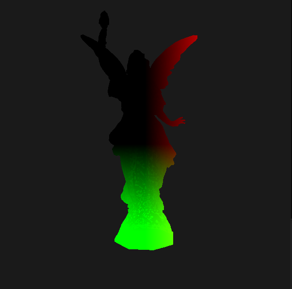

# PlyImporter

A C Stanford Polygon File Format loader (binary only).
 
## [Build status](https://github.com/MrSinho/PlyImporter/tree/main/.ShCI)

[](https://github.com/MrSinho/PlyImporter/tree/main/.ShCI/linux-log.md)
[](https://github.com/MrSinho/PlyImporter/tree/main/.ShCI/windows-log.md)


## Features

 * Support for vertex positions, UVs, vertex normals  
 * Triangle fans (quads) and lists (triangles)

## Getting started

```bash
git clone https://github.com/MrSinho/PlyImporter.git
cd PlyImporter
mkdir build && cd build
cmake #-DCONFIGURATION# ..
make
```
If you don't want to build set the cmake option `-DPLY_BUILD_EXAMPLE=OFF`. 
The built binaries can be found in `bin`

*_Always triangulate the mesh before exporting!_*

## Example

```c
PlyFileData ply = { 0 };
plyLoadFile("../Assets/stanfordLucy.ply", &ply, PLY_EXTRACT_VPOSITIONS_BIT | PLY_EXTRACT_UVS_BIT | PLY_EXTRACT_VNORMALS_BIT);

printf("vertex positions:\n");
for (uint32_t i = 0; i < ply.vertexCount * 3; i += 3) {
	printf("{ %f, %f, %f }\n", ply.pvPositions[i], ply.pvPositions[i + 1], ply.pvPositions[i + 2]);
}

printf("vertex normals:\n");
for (uint32_t i = 0; i < ply.vertexCount * 3; i += 3) {
	printf("{ %f, %f, %f }\n", ply.pvNormals[i], ply.pvNormals[i + 1], ply.pvNormals[i + 2]);
}

printf("uvs:\n");
for (uint32_t i = 0; i < ply.vertexCount * 2; i += 2) {
	printf("{ %f, %f }\n", ply.pUvs[i], ply.pUvs[i + 1]);
}

printf("indices:\n");
for (uint32_t i = 0; i < ply.faceCount * 3; i+=3) {
	printf("{ %i, %i, %i }\n", ply.pIndices[i], ply.pIndices[i + 1], ply.pIndices[i + 2]);
}

plyFree(&ply);
```

